# Performance Improvement of Double IRS-Assisted Multi User MISO System Using DDPG Algorithm

## Numerical Results

### Finding Proper Reward Function

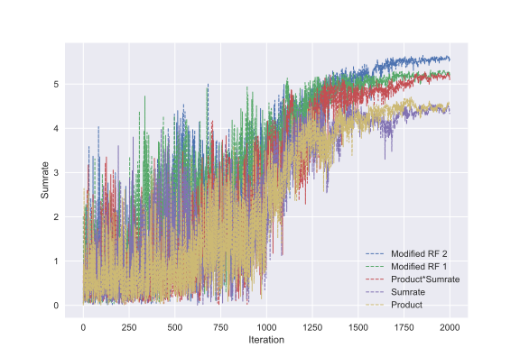

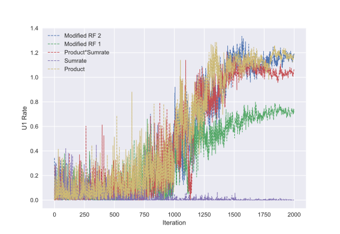

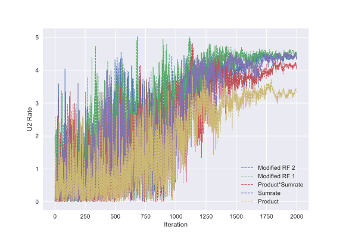

---

### Convergence of DDPG Algorithm

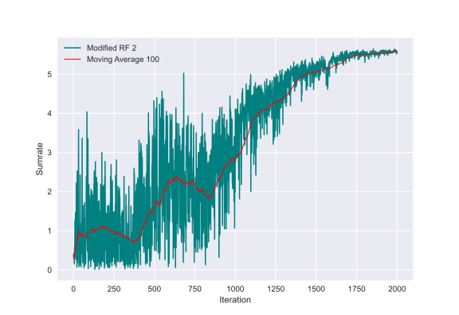

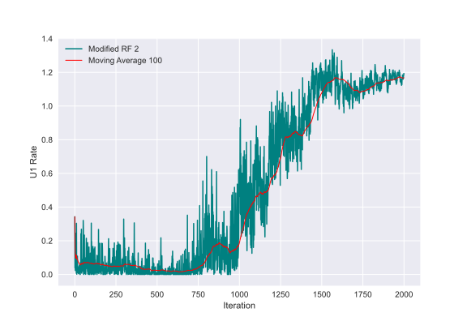

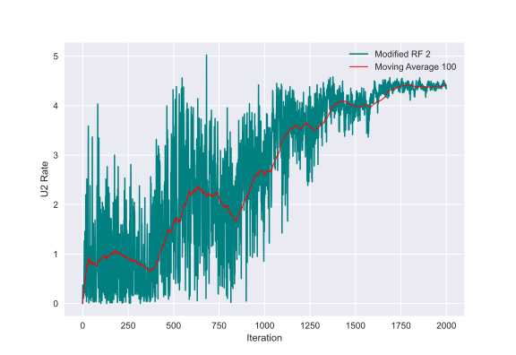

---

### IRS and Double Reflection Effect

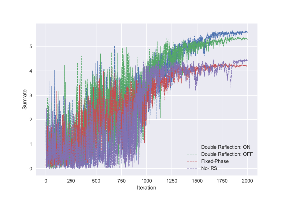

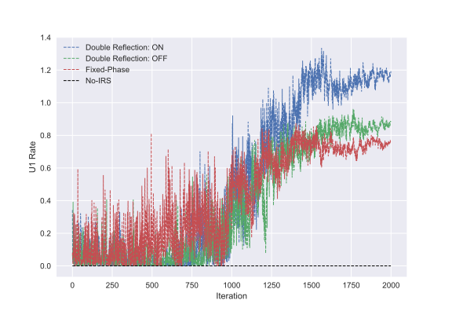

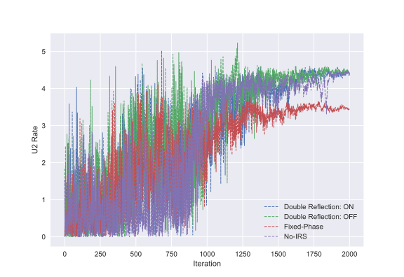

---

### IRS and Double Reflection Effect regarding to the number of IRS 1 elements

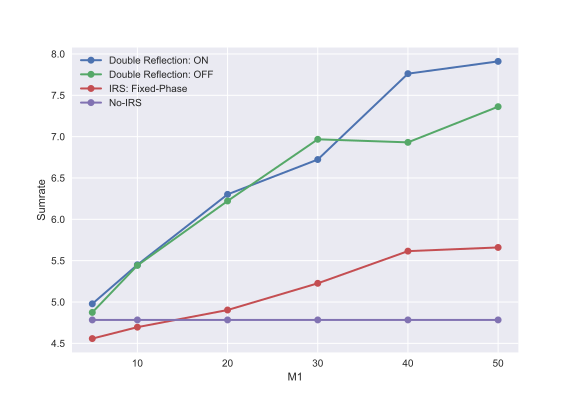

---

### Comparison of DDPG and Classical Algorithms

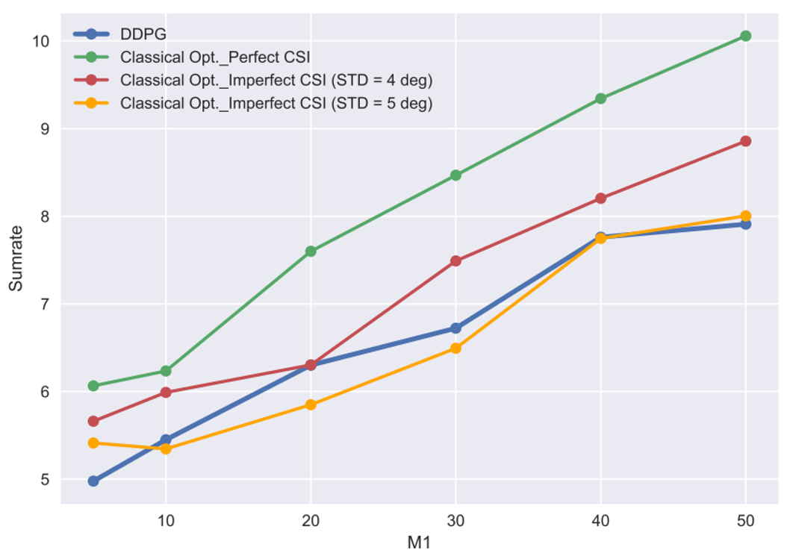

---
